# netstat

- `netstat:` se utiliza para mostrar estadísticas y detalles sobre las conexiones de red en un sistema.

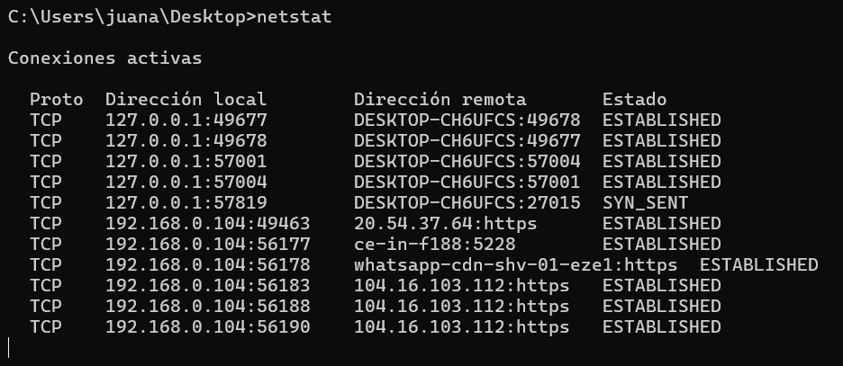

- `netstat -n:` muestra las conexiones de red activas, mostrando direcciones IP y números de puerto en formato numérico sin resolver nombres de dominio.

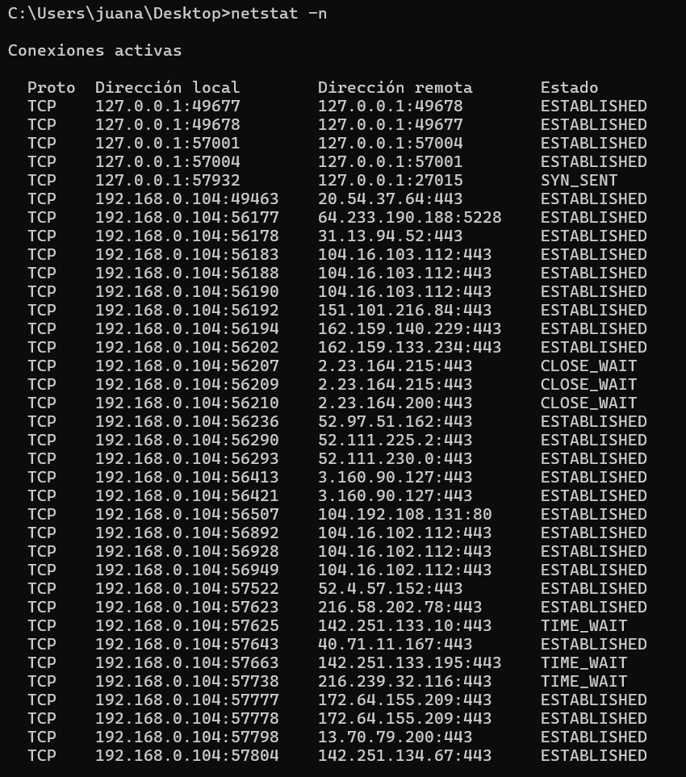

- `netstat -a:` muestra todas las conexiones de red activas y los puertos en estado de escucha, tanto TCP como UDP.

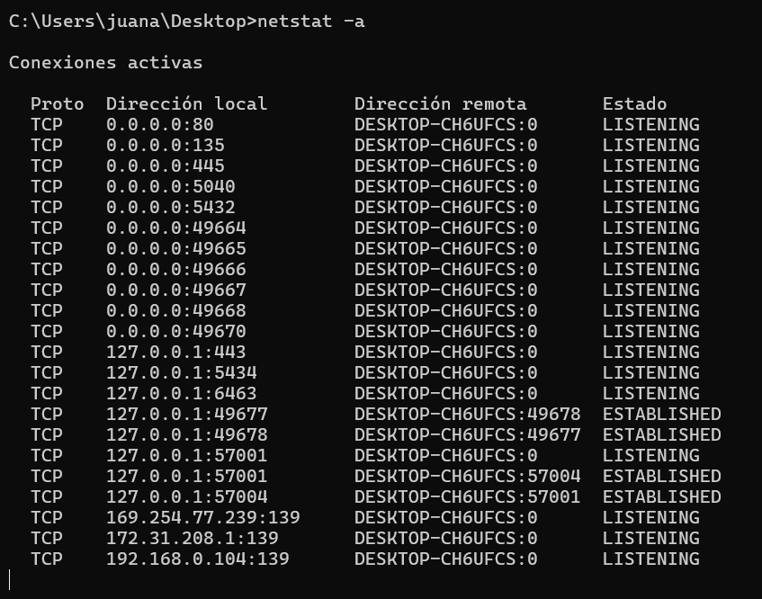

- `netstat -e:`  muestra estadísticas detalladas sobre las interfaces de red, como la cantidad de bytes y paquetes enviados y recibidos, errores de transmisión, etc.

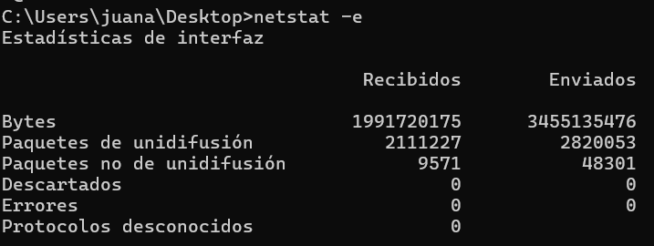

- `netstat -p:` muestra información específica sobre el protocolo que se especifique (TCP, UDP, ICMP, etc.), por ejemplo, netstat -p tcp mostrará solo conexiones TCP.

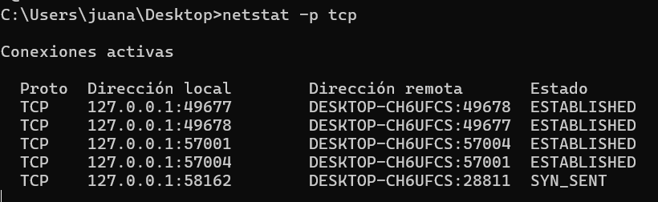

- `netstat -q:` muestra todas las conexiones TCP pendientes de cierre (conexiones en estado de espera o cola).

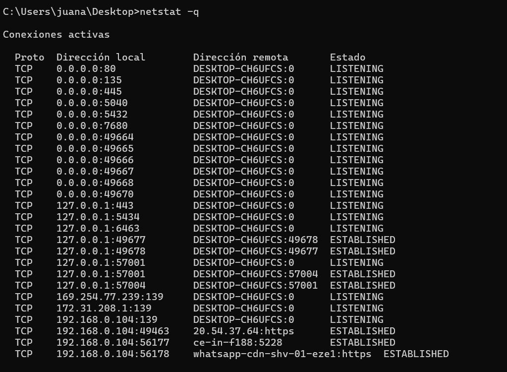

- `netstat -r:` muestra la tabla de enrutamiento IP del sistema, indicando cómo se dirigen los paquetes a través de las redes

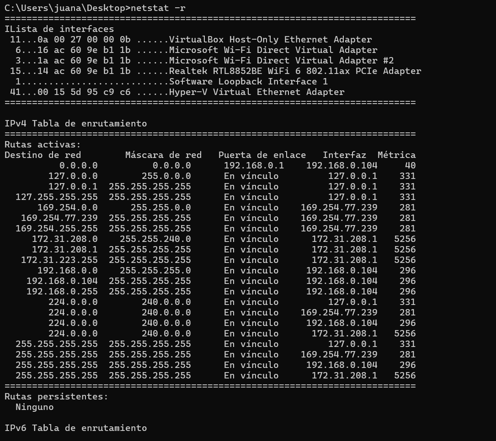
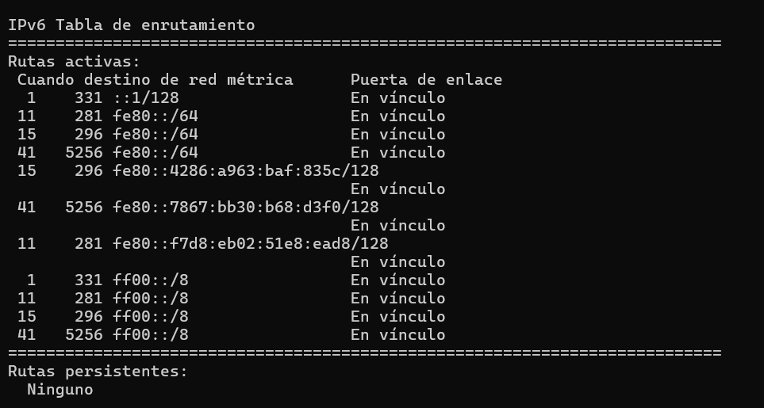

- `netstat -s:` muestra estadísticas detalladas de todos los protocolos, como TCP, UDP, ICMP, IP, indicando el número de paquetes enviados, recibidos, errores, etc.

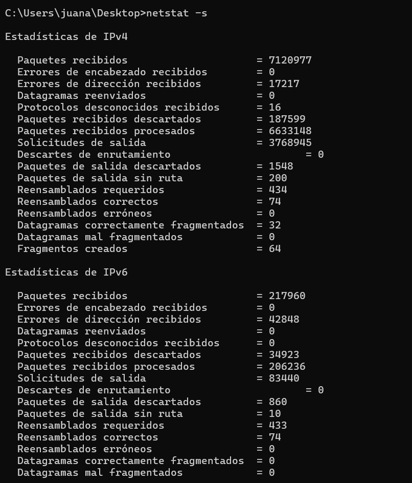
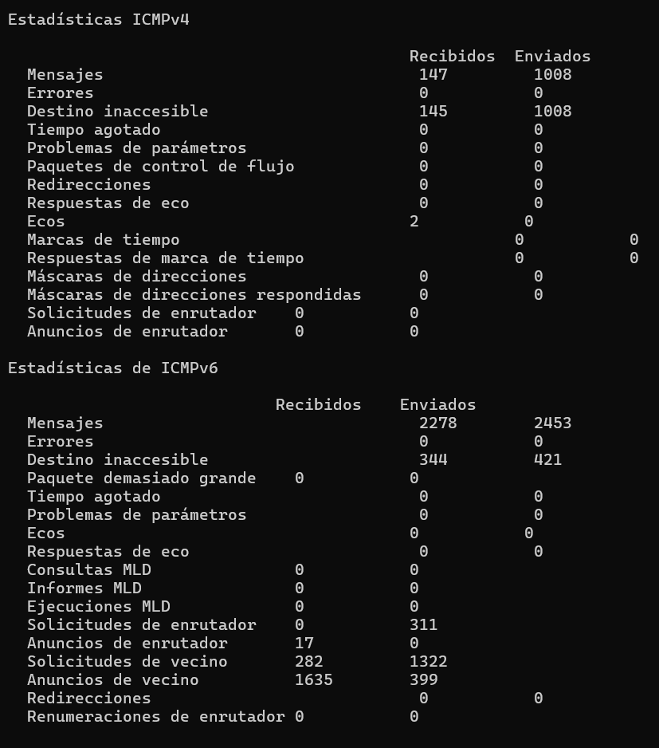
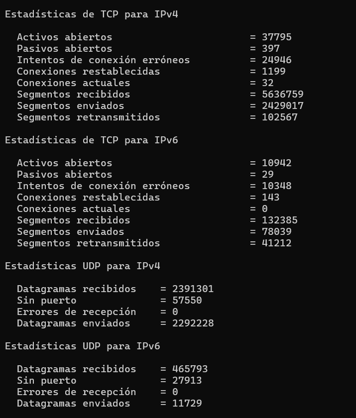
